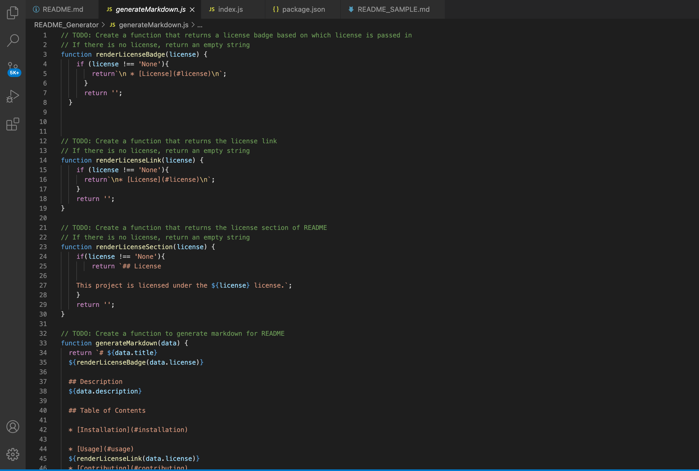
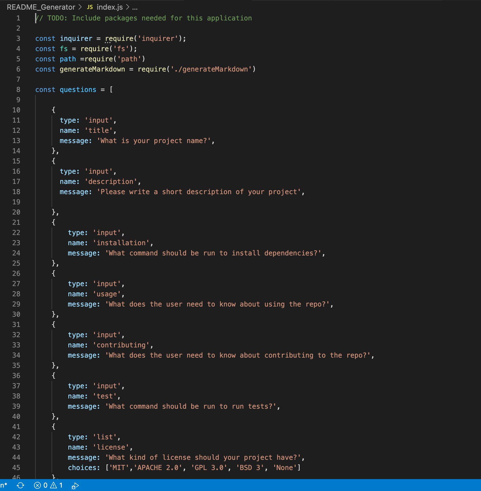
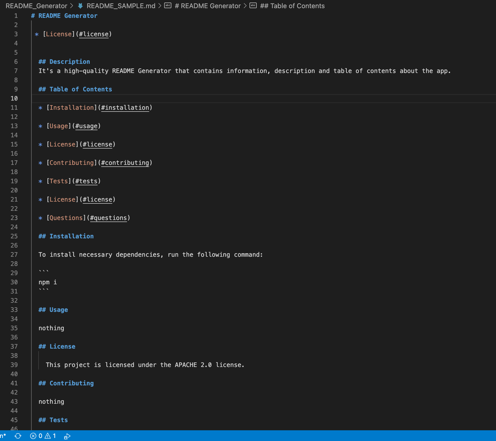

# README_GENERATOR 
It's a high-quality README Generator that contains information, description and table of contents about the app.

## LINK TO THE REPOSITORY

- The link is [README_GENERATOR](https://github.com/LShuqair/Homework2)

## LINK TO THE VIDEO
- The link is [Homework2](file:///Users/lunashuqair/Desktop/Homework/Homework2/index.html)

## SCREENSHOTS

